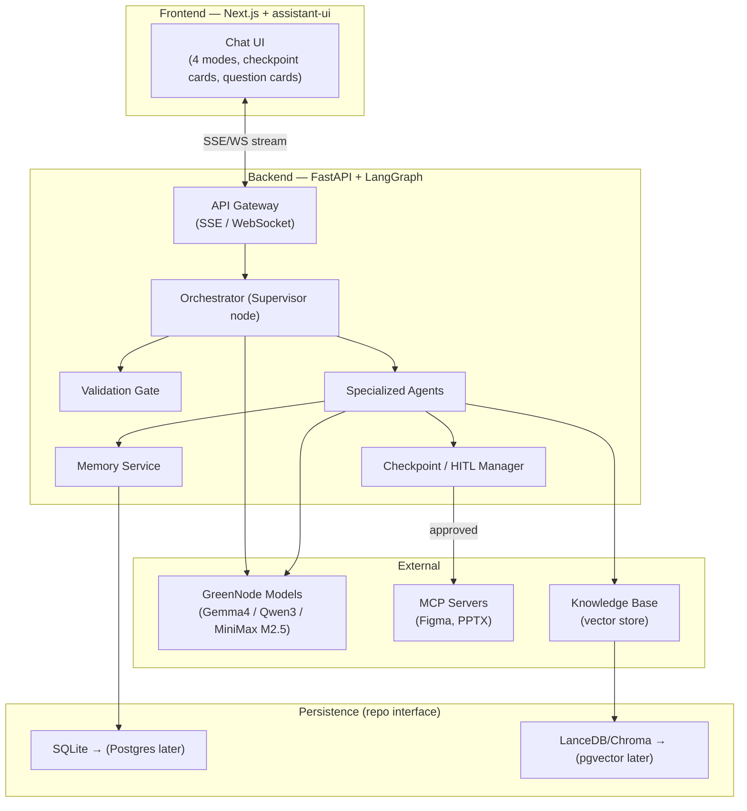
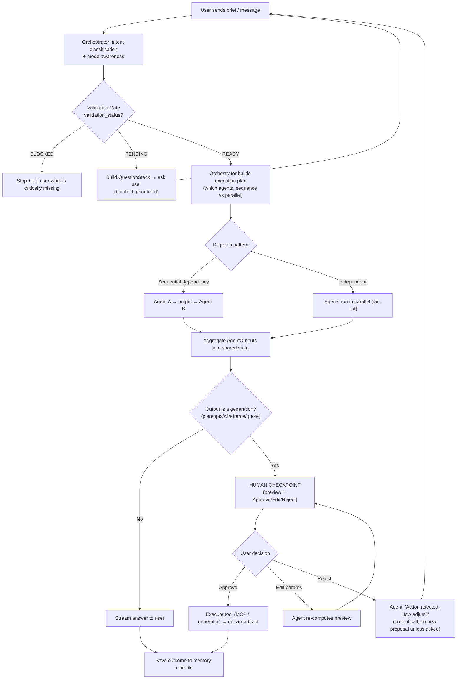
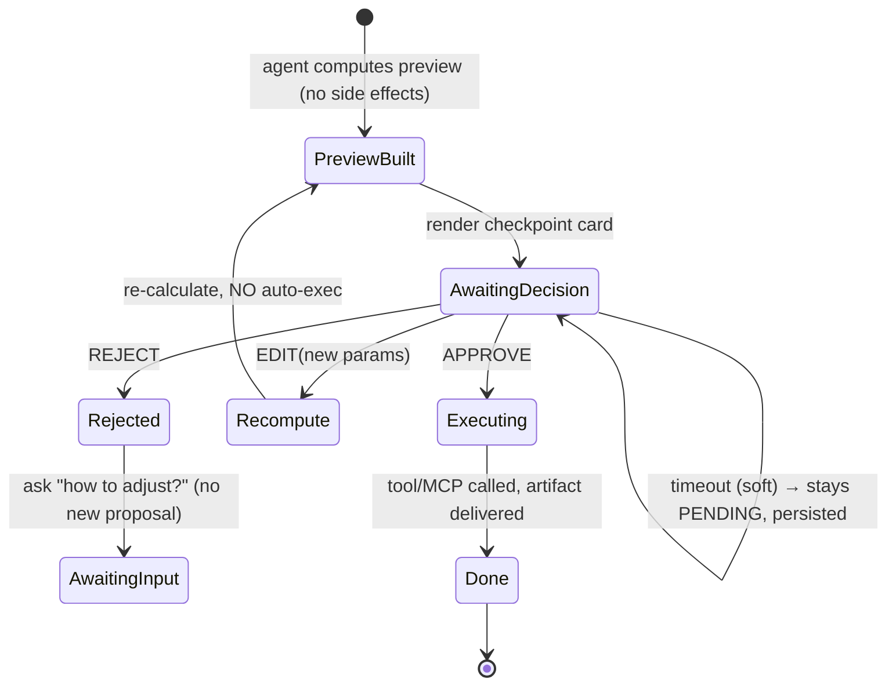
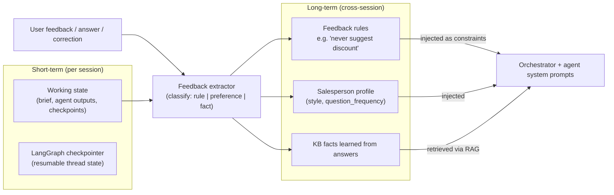
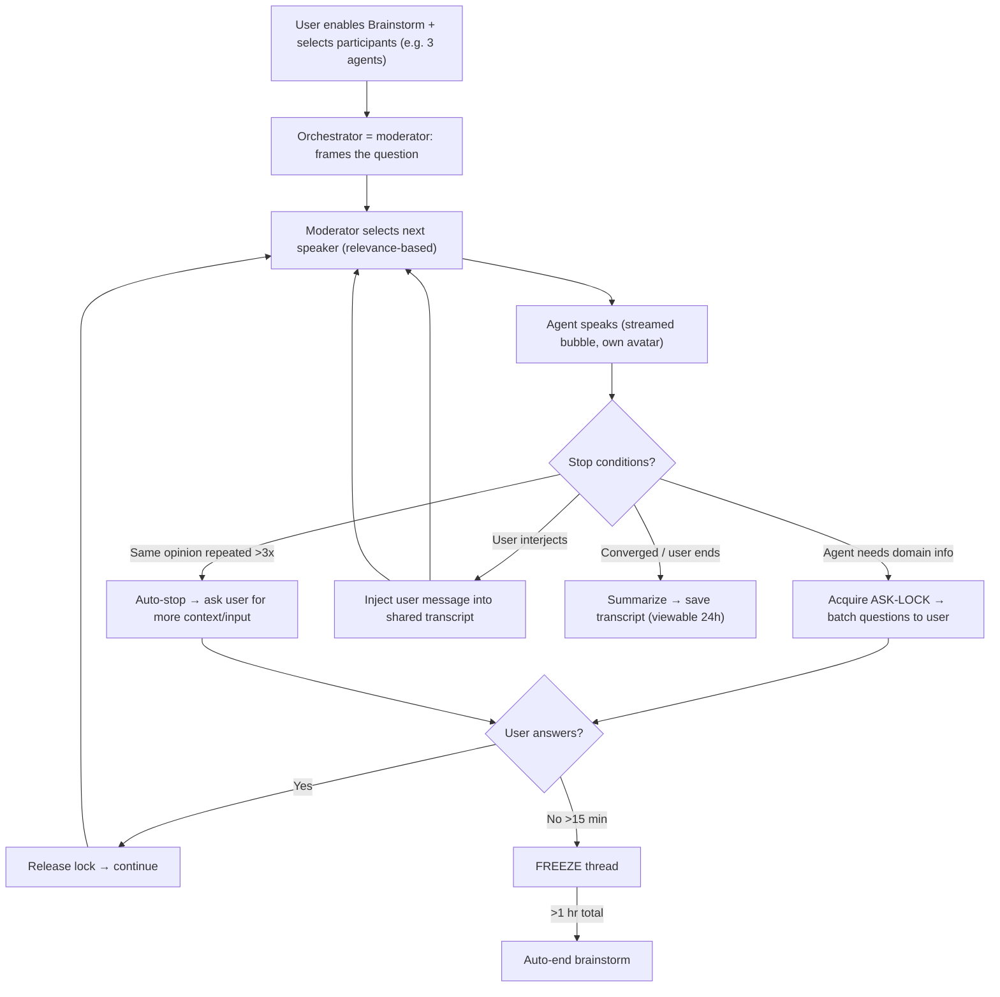
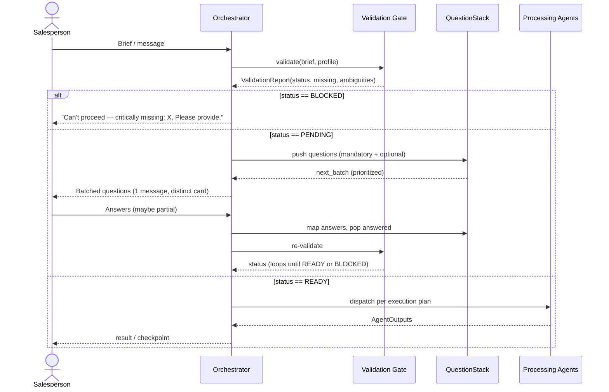
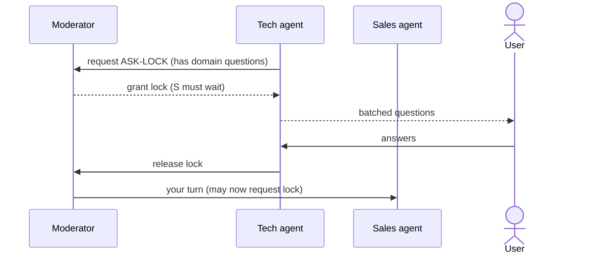

# Detailed Plan — Multi-Agent Sales AI Assistant (Hackathon)

## Context

We are building an **AI Agent chat webapp** that supports a sales team across four jobs: **sales planning, customer service, proposal generation** (userflow / wireframe / PPTX / quotation), and **tech advisory** (bridging clients and the tech team). The system is **multi-agent**: an **Orchestrator** runs first, validates the brief, and dispatches to 6+ specialized agents (Market Insight/Sales Strategy, Tech Solution, Account, AdtimaBox, Design, + Orchestrator). Each agent maps to one of three GreenNode models to play to each model's strengths. The app has 4 modes (Chat / Planning / Execute / Brainstorm), a human-approval checkpoint before any generation, conversation memory + feedback learning, and proactive "ask-back" validation.

**Locked decisions (from kickoff + Section G Q&A — FINAL):**
- **Stack:** Python backend (LangGraph, packaged as a **GreenNodeAgentBaseApp** for Runtime deploy) + Next.js/assistant-ui frontend, over SSE/WebSocket. (Tech section also compares Next.js vs plain React per request.)
- **GreenNode AgentBase managed services (adopted):** **Managed Memory** (LangGraph `CheckpointSaver` bridge + semantic long-term store), **MCP Resource Gateway** (Figma/PPTX servers), **Runtime Service** (deploy Python Custom Agent container). Each sits **behind a repository/interface** so it can be swapped for self-hosted later.
- **NOT adopted now:** Identity/OAuth2 for Figma — over-engineered for the demo phase.
- **Persistence:** AgentBase Memory is primary; **SQLite + local vector store (LanceDB)** remains the fallback impl behind the same `MemoryRepo`/`KBRepo` interface (zero-infra dev + easy swap).
- **Output fidelity:** demo-quality previews acceptable; real downloadable files are a stretch goal. **If time-boxed: PPTX deck + userflow first** (Q12).
- **Design/Figma:** for this phase the Design agent generates **FigJam wireframes** (or HTML low-fi fallback if no Figma access), behind a swappable **`DesignBackend`** interface so full Figma (+ OAuth) can be added quickly later.
- **LLM endpoint:** GreenNode MAAS, OpenAI-compatible — `https://maas-llm-aiplatform-hcm.api.vngcloud.vn/v1`; model param = the model's `path` field; tool-calling follows OpenAI schema (per-model). Models: **Gemma 4 / Qwen 3 / MiniMax M2.5** (exact `path` IDs pinned via `.env`; see Day 1 + README).
- **Language:** webapp UI fully in **English**; agents understand & reply in the **user's language** (Vietnamese in → Vietnamese out), like a mainstream chat AI.
- **Identity (demo):** salespeople identified by a **chosen name/id, no real auth**; profiles still persist.
- **Pricing (Account agent):** **hybrid** — deterministic lookup from the provided **rate-card** for listed items (predictable, the LLM narrates/explains), plus **LLM suggestion grounded in use-case KB / search** for custom features not in the rate-card (flagged as an estimate). Both pass through the human checkpoint.
- **Per-agent knowledge/skills:** each agent owns `backend/agents/<name>/{skills/, knowledge/}`; for the demo these are filled **manually** in-repo. An admin UI to add skills/knowledge per agent is a **future phase**.

**Greenfield repo** — no existing code. All choices below are net-new.

---

## SECTION A: Architecture Flow

### A.0 System layers (high level)



### A.1 Core request flow: input → Orchestrator → validation → dispatch



**Key rule on dependent agents (anti-loop):** When Agent A needs info only Agent B can supply, A does **not** call B directly. A returns a `needs: {agent, reason, context}` signal to the Orchestrator, which decides whether to invoke B. Loop prevention uses a **visited-set + max-hop depth (default 4)** tracked in shared state; a repeat request for an already-run agent on the same sub-task is denied and surfaced to the user.

### A.2 Human Checkpoint mechanism (Edit / Approve / Reject)



- **Edit:** user changes a parameter (e.g. budget 200M → 150M). The agent re-runs only the preview computation, shows the checkpoint **again**, never auto-executes.
- **Reject:** agent MUST NOT call the tool. It asks one clarifying question ("Action rejected — how would you like to adjust?") and does **not** volunteer a different action unless the user asks.
- Every checkpoint maps to exactly one **side-effecting tool call** (MCP write, file generation, pricing commit). Read-only steps never checkpoint.

**Answers to your Section A questions:**

1. **Auto-approve for already-approved action types in the same session?**
   *Resolved (Q10):* default **OFF** — each generation checkpoints by default. The checkpoint card offers a per-action-type opt-in: **"Don't ask again for [wireframes] this session."** Once chosen, that action type **auto-approves for the rest of the session** (Claude-Code-style allowlist), and is **re-armed (asks again) when the session ends or in a new session**. Irreversible/external actions (sending anything outward) are excluded and always checkpoint.

2. **Checkpoint timeout?**
   *Recommendation:* **No hard auto-reject** for checkpoints — auto-rejecting would discard computed work and frustrate users mid-thought. Instead the checkpoint persists as `PENDING` via the LangGraph checkpointer (durable), so the user can come back and resume. A **soft visual reminder** appears after N minutes ("still waiting on your approval"). (This differs from Brainstorm mode, which DOES have hard timeouts — see A.4 — because brainstorm burns tokens while looping; a single pending checkpoint burns nothing.)

3. **Does the Orchestrator need its own instance, or is it a continuously-called function?**
   It is **not a separate microservice**. It is the **supervisor node** inside the LangGraph graph — a role that is re-entered at each routing decision point (after validation, after each agent returns). Conceptually persistent (it owns the plan + visited-set in shared state), implementationally a node function the graph calls repeatedly. This keeps it cheap, debuggable, and avoids cross-process coordination for the demo.

4. **Human checkpoint: own UI or chat-based?**
   **Chat-embedded interactive card** (generative UI via assistant-ui), not a separate page. The card renders inline in the conversation with the preview + Approve / Edit / Reject controls. Rationale: keeps context, matches the conversational model, and is far less to build than a separate review console.

5. **Brainstorm: moderator or free-form?**
   **Light moderator** = the Orchestrator acting as facilitator (turn manager + stop-condition watcher), not full free-form. Reason: free-form multi-agent chat loops and burns tokens. The moderator picks the next speaker (relevance-based, not blind round-robin), enforces the "same opinion >3× → stop" rule, and manages the one-agent-asks-at-a-time lock.

### A.3 Memory & learning mechanism



A feedback like *"don't suggest discount anymore"* is parsed into a **constraint rule** (`{type: NEGATIVE_CONSTRAINT, scope: pricing, rule: "no discount suggestions"}`) stored in long-term memory and **injected into the Account agent + Orchestrator system prompt** on every future turn for that salesperson — so it is structurally impossible to re-suggest, not just "hopefully remembered." Details + schema in Section D.

### A.4 Brainstorm mode flow



**Performance / token-burn controls (mandatory):**
- **Relevance-based speaker selection** (not every agent speaks every round) — cuts calls per round.
- **Convergence detector:** embed each new opinion; if cosine-similarity to the last 3 of that agent's points > threshold (e.g. 0.9), count as a repeat. **>3 repeats → auto-stop** and request user input.
- **Max rounds cap** (e.g. 8) as a hard backstop regardless of convergence.
- **One ASK-LOCK** at a time: only one agent may question the user; others wait (see C.5 §7).
- **Timeouts:** no user reply >15 min → **freeze**; >1 hr total → **auto-end**.
- **Transcript retention:** 24h, then purge (config flag).

---

## SECTION B: Multi-Agent Orchestration Design

### B.1 Router/Supervisor pattern — **Supervisor (orchestrator-as-router) with explicit handoff**

| Pattern | How it works | Verdict |
|---|---|---|
| **Supervisor / Router (CHOSEN)** | Central Orchestrator owns the plan; agents return to it; it decides next hop. | ✅ Matches your "Orchestrator always runs first + decides flow + anti-loop" requirement exactly. Easy to add/remove agents (just register them). |
| Network / Swarm | Any agent can hand off to any agent directly. | ❌ High loop risk, hard to reason about, contradicts your central-control requirement. |
| Static pipeline | Fixed A→B→C chain. | ❌ Too rigid; can't branch by intent or run parallel groups. |

LangGraph's `create_supervisor` / `Command(goto=...)` handoff primitive implements this directly, with the durable checkpointer giving us HITL + resume for free. Adding an agent = registering a node + a routing description; removing one = deleting its registration. **Agents are config-driven** (see F).

### B.2 State management — **single typed shared state + standardized AgentOutput contract**

All agents read/write one **`SalesCaseState`** object (LangGraph state schema, Pydantic-typed). Agent A (Tech Solution) writes a standardized `AgentOutput`; Agent B (Account) reads it from state — no ad-hoc message passing.

```python
class AgentOutput(BaseModel):
    agent: str
    status: Literal["COMPLETE", "NEEDS_INPUT", "NEEDS_AGENT", "FAILED"]
    payload: dict                      # the actual result (structured)
    summary: str                       # short, for the transcript/UI
    confidence: float                  # 0..1, feeds validation
    needs: Optional[NeedsRequest] = None   # {agent, reason, context} — anti-loop
    questions: list[Question] = []         # pushed to QuestionStack if NEEDS_INPUT

class SalesCaseState(TypedDict):
    brief: Brief
    mode: Literal["chat","planning","execute","brainstorm"]
    validation_status: Literal["PENDING","READY","BLOCKED"]
    question_stack: list[Question]
    plan: ExecutionPlan
    outputs: dict[str, AgentOutput]    # keyed by agent name
    visited: list[str]                 # anti-loop guard
    hop_depth: int
    profile: SalespersonProfile
    constraints: list[FeedbackRule]    # injected negative/positive rules
    checkpoint: Optional[Checkpoint]
```

Standardization means the Account agent always finds Tech Solution's result at `state.outputs["tech_solution"].payload` in a known shape — defined by per-agent Pydantic payload schemas.

### B.3 Communication between agents — **in-process graph edges (direct), not event bus/queue**

| Option | Verdict |
|---|---|
| **Direct (LangGraph edges / shared state) — CHOSEN** | ✅ Simplest, lowest latency, fully traceable, perfect for a single-process demo. |
| Event bus (e.g. Redis pub/sub) | Deferred — only needed if agents become separate services or for real-time brainstorm fan-out at scale. We keep a thin `EventBus` interface so we can drop Redis in later without rewrites. |
| Task queue (Celery/RabbitMQ) | ❌ Overkill for the demo; adds infra and failure modes. |

For **brainstorm** specifically, agents share one append-only `transcript` channel in state; the moderator controls turns. The same `EventBus` interface fronts the SSE stream to the UI so we can swap the transport later.

### B.4 Handoff mechanism — **return-to-supervisor, never peer-to-peer**

- An agent signals "I'm done" by returning `AgentOutput(status=COMPLETE)`; control returns to the Orchestrator (LangGraph `Command(goto="orchestrator")`).
- If it needs another agent first, it returns `status=NEEDS_AGENT, needs={agent, reason, context}` — the **Orchestrator** (not the agent) decides whether to honor it, checking the visited-set/hop-depth guard to prevent A→B→A loops.
- The Orchestrator decides the next hop from: the execution plan, the returned statuses, and validation state. It transfers control only forward through the plan, or to a requested helper agent if the anti-loop guard permits.

### B.5 Error handling in parallel groups — **isolate, continue, then decide**

- Parallel (fan-out) agents run independently; a failure in one does **not** abort the others. Each returns `status=FAILED` with an error summary instead of throwing.
- **Retry policy:** 1 automatic retry with backoff for transient model/API errors (timeout, 5xx, rate-limit).
- After the barrier, the Orchestrator inspects the result set:
  - All critical agents OK → proceed.
  - A **critical** agent failed (declared per-task) → surface to the user with what failed and offer retry/skip; do not silently produce a partial proposal.
  - A **non-critical** agent failed → proceed and note the gap in the output ("Market sizing unavailable; proceeding without it").
- This gives graceful degradation without hiding failures (honest reporting requirement).

---

## SECTION C: Design System & Webapp Chat

### C.1 Main chat layout

```
┌────────────┬─────────────────────────────────────────────┬───────────────┐
│  SIDEBAR   │            MAIN CHAT CANVAS                  │  CONTEXT PANEL │
│            │                                              │   (collapsible)│
│ • Mode     │  [agent avatar] Orchestrator                 │ • Running      │
│   switch   │   "Analyzing your brief..."                  │   agents +     │
│   (4 tabs) │                                              │   live status  │
│ • New chat │  ┌─ QUESTION CARD (yellow border, ? icon) ─┐ │ • Brief summary│
│ • History  │  │ 1. (required) Industry?                 │ │ • Active       │
│   (24h for │  │ 2. (optional) Budget? [skip→assume X]   │ │   constraints  │
│   brainstm)│  └─────────────────────────────────────────┘ │   (feedback    │
│ • Active   │                                              │    rules)      │
│   agents   │  ┌─ CHECKPOINT CARD ──────────────────────┐ │ • Artifacts    │
│   list     │  │ Preview: Quotation 180M VND            │ │   (downloads)  │
│ • KB status│  │ [Approve] [Edit] [Reject]              │ │                │
│            │  └─────────────────────────────────────────┘ │                │
│            │  [ message composer ............... ▶ ]     │                │
└────────────┴─────────────────────────────────────────────┴───────────────┘
```

- **Sidebar (left):** mode switcher, new chat, history (brainstorm sessions flagged + 24h timer), live "active agents" list with status dots (idle / thinking / waiting-for-you / failed), KB connection status.
- **Context panel (right, collapsible):** brief summary, active constraints (learned feedback rules so the user sees *why* the agent behaves a certain way), generated artifacts with preview/download.

### C.2 Mode switch — 4 modes and how behavior changes

| Mode | Orchestrator behavior | Checkpoints | Output |
|---|---|---|---|
| **Chat** | Q&A / advisory; minimal dispatch, mostly answers from KB + memory. | None (read-only). | Conversational answers. |
| **Planning** | Builds a structured sales plan; dispatches Market Insight + Strategy; produces a plan draft. | **Yes** before finalizing the plan. | Structured plan (preview). |
| **Execute** | Runs the generation pipeline (proposal/wireframe/PPTX/quote); maximal dispatch + tool calls. | **Yes** before every side-effecting generation. | Artifacts (preview-quality). |
| **Brainstorm** | Becomes moderator; group chat among selected agents. | Ask-lock instead of checkpoints; no artifact generation. | Discussion + summary transcript. |

Switching mode changes the system prompt + which graph subgraph runs; it does **not** wipe session state (the brief carries across modes).

### C.3 Brainstorm mode UI specifics

- **Add-members modal** (like a messaging app): dropdown/modal listing available agents with checkboxes; user picks participants before/while brainstorming; can add/remove mid-session.
- **Group-chat rendering:** each agent has its own **avatar, name, and colored chat bubble**; the user's bubble is distinct; the moderator's facilitation lines are styled as system/neutral.
- **User interjection:** **Yes** — the user is a first-class group member and can type at any time; their message is injected into the shared transcript and the moderator re-routes (per A.4). While an agent holds the ASK-LOCK, the composer shows "Tech agent is asking you →" and other agents are visibly waiting.
- A subtle **round/▲token meter** shows brainstorm progress toward the max-round cap so users see why it will stop.

### C.4 Human checkpoint UI

- Inline **checkpoint card** with: a human-readable **preview** of what will be produced, the **editable parameters** (inline fields), and three buttons: **Approve** (primary), **Edit** (re-previews), **Reject** (asks how to adjust). Optional **"don't ask again for this action this session"** checkbox (A.1).
- On Reject, the card collapses to a "rejected" state and the agent posts its single clarifying question; no new proposal appears unless requested.

### C.5-UI note: question cards are visually distinct from checkpoint cards (yellow/`?` vs neutral/action) so users instantly know "answer me" vs "approve me".

**Next.js vs plain React (you asked to compare):**

| | **Next.js (App Router) — RECOMMENDED** | Plain React (Vite SPA) |
|---|---|---|
| Streaming UX | First-class RSC + streaming, Suspense, route handlers as a thin BFF to FastAPI | Possible but you wire streaming yourself |
| SEO/share links | Built-in (useful if proposals get shareable URLs) | Needs extra setup |
| assistant-ui fit | Officially documented with Next.js; smoothest path | Works, less documented |
| Build complexity | Slightly heavier; opinionated | Lighter, simplest mental model |
| **UX/perf verdict** | **Better perceived performance** (streaming, code-split routes, image opt) and a clean BFF layer to proxy SSE/WS to FastAPI → recommended | Fine for a pure SPA, but you rebuild the streaming/routing niceties |

**Recommendation:** **Next.js** — the streaming primitives and the BFF route layer materially improve the chat UX and keep secrets (GreenNode key) off the client, with little extra cost for a team that knows React.

---

## SECTION C.5: Validation & Active Questioning Mechanism

### 1. When must the agent ask back? (trigger conditions)

- **Missing mandatory field** in the brief (e.g. industry, budget band, core objective) for the requested job.
- **Ambiguity detected** — more than one plausible interpretation of the request.
- **Low KB confidence** — retrieval/answer confidence below threshold (e.g. < 0.7) → ask rather than hallucinate.
- **Out-of-scope / requires human approval.**
- **First interaction with a new salesperson** (no profile yet) — lightweight onboarding (preferred style, defaults).
- **After a "that's not what I meant" correction** → must re-ask to recover intent.

**Ambiguity detection mechanism (proposed):** a cheap fast-model (Gemma 4) pre-pass that, per incoming brief, emits a structured `ValidationReport`:
```python
class ValidationReport(BaseModel):
    missing_required: list[str]
    ambiguities: list[Ambiguity]      # {field, interpretations:[...], why}
    kb_confidence: float
    out_of_scope: bool
    status: Literal["READY","PENDING","BLOCKED"]
```
Ambiguity is flagged when the model returns ≥2 distinct interpretations for the same slot, OR an enum/required slot is unfilled, OR a numeric field is out of an expected range. This pre-pass is intentionally a small/fast model to keep latency and cost low.

### 2. QuestionStack mechanism

```python
class Question(BaseModel):
    id: str
    text: str
    priority: int                 # 1 = highest
    is_mandatory: bool
    assumption: Optional[str]      # what we'll do if skipped (optional Qs only)
    target_field: str              # which brief slot it fills
    asked_count: int = 0
    last_asked_at: Optional[datetime] = None
    answered: bool = False
    answer: Optional[str] = None
    was_helpful: Optional[bool] = None   # feedback label

class QuestionStack(BaseModel):
    items: list[Question]
    def next_batch(self) -> list[Question]: ...   # unanswered, sorted by priority,
                                                  # mandatory first; dedup already-asked
```

**Flow:** detect missing info → create `Question`(s) → push to stack → **batch** all currently-known questions into ONE message (mandatory first, then optional with stated assumptions) → wait → on answer, map answers to `target_field`, mark `answered`, pop → re-run validation. Already-asked questions are not re-asked unless the user answered ambiguously (then `asked_count++` with a rephrase).

### 3. Integration with Orchestrator (Orchestrator must NOT dispatch while mandatory questions are open)



Orchestrator checks `validation_status` **before** any dispatch: `PENDING` → ask, don't dispatch; `BLOCKED` → stop + notify; `READY` → dispatch.

### 4. Learning from questions

- **Response-style learning:** infer brevity vs detail preference from answer length/format; store on profile (`style: terse|balanced|detailed`) and adapt future question phrasing + answer verbosity.
- **New-information learning:** answers update session brief immediately and, if durable (a stable fact about the salesperson/their accounts), get written to long-term memory/KB.
- **Frustration detection:** if the user signals annoyance ("why do you keep asking") → lower `question_frequency` for that salesperson and bias toward stated assumptions over asking.
- **Feedback loop:** each question carries `was_helpful` (explicit thumbs, or inferred — e.g. an answered question that changed the output = helpful; an ignored/"obviously" answer = not). Profile metric: `question_frequency = useful_answers / total_questions_asked`, used to tune how aggressively the agent asks.

### 5. UI for "agent is asking"

- Question messages render in a **distinct card** (yellow left-border + `?` icon) — clearly different from normal answers and from checkpoint cards.
- Multiple questions → **numbered list**; mandatory ones tagged **(required)**, optional ones tagged **(optional — if skipped, I'll assume: …)** with a **Skip** affordance.
- The user can answer **inline per question** (each has its own quick-reply field) or answer in **one free-text reply** — the backend maps answers to `target_field` automatically (LLM-assisted mapping when free-text).

### 6. Answers to your Section C.5 questions

- **Mandatory vs nice-to-have:** **Yes, distinguish them.** Mandatory blocks dispatch; nice-to-have never blocks — it's asked with a stated assumption and a Skip option.
- **Partial answers (2 of 3):** map what was answered, keep the unanswered ones in the stack, and **re-ask only the remaining**, still batched and still prioritized high→low. Never re-ask what's answered.
- **Optional questions:** always told they're optional, with an explicit stated assumption ("if no answer, I'll proceed assuming monthly budget ≈ industry median"). **Skipping = the user accepts that assumption** (recorded as an implicit approval).
- **Re-validation on brief update — severity-gated:** classify each edit. **Non-critical** change (budget 100M→200M) → no re-validation, just adapt (e.g. suggest a higher package). **Critical** change (tech stack A→B requiring different tooling, or industry switch) → **re-validate**, because downstream agent choices change. The severity classifier is part of the validation pre-pass (each field tagged with a `revalidation_impact` level).
- **Proactive suggested answers from history:** **Yes.** When a profile exists, the agent pre-fills likely answers from past cases ("Last time you chose Solution A — same this time?") so the user confirms instead of typing. Speeds up and personalizes.

### 7. Brainstorm extension — one agent asks at a time (ASK-LOCK)



**Proposed mechanism:** a single mutex `ask_lock` in brainstorm state. Only the lock-holder may question the user; others queue. Each agent still **batches** its questions (no one-at-a-time spam). The moderator grants the lock **moderator-prioritized by relevance** (not strict FIFO — resolved), blocks others until release, then continues turn selection. If the lock-holder times out (15 min), the freeze rule from A.4 applies.

---

## SECTION D: Memory & Learning Mechanism

### D.1 Short-term memory (within session)

- **Storage:** **AgentBase Managed Memory** via the LangGraph bridge — `AgentBaseMemoryEvents` (a LangGraph `CheckpointSaver`) keyed by `thread_id` (one per chat session) → durable, resumable, time-travel for HITL, managed by the platform. **Fallback impl:** LangGraph's SQLite `CheckpointSaver` behind the same interface for local dev / no-platform runs.
- **Structure:** the `SalesCaseState` (B.2) is the session record: brief, mode, outputs, question_stack, plan, checkpoint, visited/hop_depth. Rolling message window + a running **session summary** (to keep token use bounded on long chats).

```json
{
  "session_id": "sess_2026_...",
  "salesperson_id": "sp_minh",
  "mode": "execute",
  "brief": {"industry": "F&B", "budget_vnd": 180000000, "goal": "Q3 launch"},
  "summary": "Proposal for F&B client, 180M budget, wireframe + PPTX requested.",
  "outputs": {"tech_solution": {...}, "account": {...}},
  "question_stack": [...],
  "checkpoint": {"type": "quotation", "status": "AWAITING", "preview": {...}}
}
```

### D.2 Learning from feedback (long-term)

Feedback is parsed by a **feedback extractor** into typed records, persisted cross-session via **AgentBase Memory's long-term store** (`MemoryClient` with a `USER_PREFERENCE`/`CUSTOM` strategy + `remember`/`recall` tools; SQLite fallback locally), then **injected as constraints** into the relevant agents' prompts (structural enforcement, not "hope it remembers").

```json
{
  "rule_id": "rule_001",
  "salesperson_id": "sp_minh",
  "type": "NEGATIVE_CONSTRAINT",
  "scope": ["account", "orchestrator"],
  "rule": "Never proactively suggest discounts.",
  "source_quote": "don't suggest discount anymore",
  "created_at": "2026-06-12T...",
  "active": true
}
```

**How Account/Orchestrator avoid it next time:** on every turn, the system loads `active` rules for that salesperson and **prepends them to the system prompt** of the in-scope agents. The Account agent therefore never even generates a discount suggestion. Rules are listed in the UI Context panel so the behavior is transparent and revocable.

### D.3 Personalization profile

- **Per-salesperson profile** — lightweight, no heavy auth for demo (identify by a chosen name/id; pluggable to real auth later).
- Updated after each decision (chosen solution, accepted/rejected proposals, question helpfulness, style signals).

```json
{
  "salesperson_id": "sp_minh",
  "display_name": "Minh",
  "style": "terse",
  "question_frequency": 0.42,
  "preferences": {"default_currency": "VND", "favored_solution": "A"},
  "constraints": ["rule_001"],
  "history": [{"case": "F&B Q2", "chosen_solution": "A", "outcome": "won"}],
  "updated_at": "2026-06-12T..."
}
```

All persistence goes through a **repository interface** (`MemoryRepo`, `ProfileRepo`, `KBRepo`) with two interchangeable impls: **AgentBase Memory** (primary) and **SQLite/LanceDB** (local fallback) — so we can run with or without the platform and later swap to Postgres+pgvector+Redis with no business-logic changes.

---

## SECTION E: Techstack Recommendation (with comparison)

| Layer | Recommended | Alternative(s) | Why recommended |
|---|---|---|---|
| **Agent orchestration** | **LangGraph (Python)** | CrewAI; AutoGen; OpenAI Agents SDK | Native **interrupt-before-tool HITL** + durable **checkpointer** (resume) + supervisor prebuilt — the exact features your checkpoint/anti-loop/resume requirements need; plus an official **AgentBase LangGraph bridge** for managed memory. CrewAI is faster to prototype but weaker at deterministic tool-gating; AutoGen's persistence is weaker. |
| **Backend / runtime packaging** | **GreenNodeAgentBaseApp** (SDK web server) wrapping the LangGraph graph; **FastAPI** for any extra HTTP routes | Raw FastAPI only (self-host) | AgentBaseApp conforms to the Runtime Service Contract (port, health check, auto-injected creds) → deploys natively on AgentBase Runtime with autoscale/versioning; FastAPI alone would need us to hand-roll that contract. Still async-native; Pydantic models double as our state schemas. |
| **Frontend framework** | **Next.js (App Router)** | Plain React (Vite SPA) | Streaming RSC + BFF route layer (keeps keys server-side) + best assistant-ui support → better perceived UX. (Full comparison in C.) Deployed separately from the agent runtime. |
| **Chat UI library** | **assistant-ui** | CopilotKit; Vercel AI SDK `useChat` | Best custom-message rendering for **group-chat avatars/bubbles** + inline generative-UI cards (question/checkpoint). CopilotKit is strongest for out-of-box approval flows but heavier/more opinionated; we want custom brainstorm UI. Vercel AI SDK can power the streaming transport under assistant-ui. |
| **Models (GreenNode MAAS, OpenAI-compatible, endpoint above)** | **MiniMax M2.5** → Orchestrator + Tech Solution (reasoning/agentic); **Qwen 3** → Market/Strategy/Account/AdtimaBox (balanced, reliable tool-calling); **Gemma 4** → fast validation pre-pass + Design intent (fast/vision) | swap per-agent via config (`MODEL_*` env vars) | Plays to each model's strength; per-agent mapping is config so it's trivially re-tunable. Model param = the model's `path` field. Gemma's function-calling is not first-class → keep it on classification/vision, not heavy tool loops. Exact `path` IDs pinned in `.env`. |
| **Memory** | **AgentBase Managed Memory** (LangGraph `CheckpointSaver` bridge + semantic long-term store) | SQLite checkpointer + local table (fallback) | Managed, native to the platform, gives short-term resume + long-term feedback learning with little custom code; SQLite fallback keeps local dev infra-free. Both behind `MemoryRepo`. |
| **Vector store (RAG/KB)** | **LanceDB** (local) | Chroma; pgvector | Embedded, no server, fast local similarity search for the demo KB; behind `KBRepo` so it can move to a managed/pgvector store later. |
| **Embeddings/rerank** | **GreenNode `bge-m3` + `bge-reranker-v2-m3`** | OpenAI embeddings | Same provider/key as the LLMs; strong multilingual (incl. Vietnamese) for the KB. |
| **Realtime transport** | **SSE for agent token streaming**; **WebSocket for brainstorm group chat** | WS-only; polling | SSE is simplest for one-way token streams; brainstorm's bidirectional multi-party chat justifies WS. |
| **PPTX generation** | **python-pptx** (+ optional **Office-PowerPoint-MCP-Server** via the gateway) | PptxGenJS (JS) | Best for **branded templated decks** (open a master `.pptx`, preserve theme/layout, fill placeholders); stays in our Python backend. (Demo: preview-quality first, real file as stretch.) |
| **Wireframe / design** | **FigJam wireframes** behind a swappable **`DesignBackend`** interface; HTML low-fi as the no-Figma fallback | Full Figma + OAuth (deferred) | OAuth/Figma is over-engineered for the demo; FigJam covers wireframes now, and the interface lets us add full Figma (+ Identity OAuth) quickly later without rework. |
| **MCP integration** | **AgentBase MCP Resource Gateway** (register Figma/PPTX servers, managed auth/policy) | Direct Python MCP client SDK in-process | Managed proxy gives centralized auth/policy and easy add/remove of servers; direct client is the local-dev fallback. |
| **Auth / identity (demo)** | **Chosen name/id, no real auth** | AgentBase Identity OAuth2 (deferred) | Matches the demo scope; profiles still persist. Identity service is ready for a later phase. |

---

## SECTION F: Implementation Roadmap (7 days)

Principle: **core conversational + orchestration + validation + memory first** (these are the "must-have, must be solid"), generation/MCP features layered on, everything **config-driven** for easy add/remove/scale of agents.

### Day 1 — Foundations & contracts
- Repo scaffold: `/backend` (LangGraph wrapped in **GreenNodeAgentBaseApp**), `/frontend` (Next.js + assistant-ui).
- **`.env.example`** (LLM_BASE_URL, LLM_API_KEY, per-agent `MODEL_*` paths, AgentBase IDs) + **`README.md`** with a step-by-step **"get your GreenNode key + list model `path` IDs"** guide. User fills `.env`.
- **GreenNode LLM wrapper** (`backend/llm/greennode.py`) — OpenAI client at the MAAS endpoint, per-agent model mapping from `MODEL_*` env.
- Define core schemas (`AgentOutput`, `SalesCaseState`, `Question`, `ValidationReport`, profile/rule) in `backend/schemas/`.
- Repository interfaces + dual impls: **AgentBase Memory** (primary) and **SQLite/LanceDB** (fallback) in `backend/repos/`.
- **Deliverable:** `POST /chat` runs one LLM call end-to-end with SSE streaming to a minimal Next.js chat; runs locally with the SQLite fallback even before AgentBase creds exist.

### Day 2 — Orchestrator + agent registry + routing
- `backend/agents/base.py` (agent contract), `backend/agents/registry.py` (config-driven add/remove).
- Orchestrator supervisor node + LangGraph graph wiring + checkpointer (AgentBase Memory bridge, SQLite fallback).
- Anti-loop guard (visited-set + hop-depth).
- Stub all 6 agents (config-driven via `config/agents.yaml` + `backend/agents/<name>/{prompt.md, skills/, knowledge/}`); each returns structured `AgentOutput`.
- **Deliverable:** brief → orchestrator → dispatches to ≥2 stub agents → aggregated answer streamed.

### Day 3 — Validation & QuestionStack (must-have)
- Validation pre-pass (Gemma 4) → `ValidationReport`; ambiguity + severity classification.
- `QuestionStack` + batching/prioritization + answer mapping.
- Orchestrator gate (`PENDING`/`READY`/`BLOCKED`) blocks dispatch.
- Frontend **question card** (distinct style, numbered, optional+assumption+skip).
- **Deliverable:** incomplete brief → batched questions → answers → dispatch (sequence diagram C.5 §3 working).

### Day 4 — Memory & learning (most important)
- Short-term: session state via AgentBase Memory checkpointer bridge (SQLite fallback) + rolling summary.
- Feedback extractor → typed rules persisted to AgentBase long-term store; constraint injection into agent prompts.
- Profile create/update; style + `question_frequency` learning; history-based suggested answers.
- Context panel shows active constraints.
- **Deliverable:** "don't suggest discount" persists and provably suppresses discounts next session.

### Day 5 — Human checkpoint + real agent logic + KB/RAG
- Checkpoint manager (interrupt-before-tool), state machine (Approve/Edit/Reject), inline checkpoint card + **session-scoped "don't ask again for this action type"** (re-armed next session — Claude-Code-style, Q10).
- Flesh out agents with KB RAG (LanceDB + bge embeddings/rerank); ingest the demo `.md` knowledge per-agent (`agents/<name>/knowledge/`), with pluggable loaders (PDF/CSV/PNG = future).
- **Account pricing = hybrid:** deterministic rate-card lookup for listed items (LLM narrates) + LLM suggestion grounded in use-case KB/search for custom features (flagged as estimate).
- **Deliverable:** Planning/Execute flow produces a previewed plan/quotation gated by a working checkpoint; edit re-previews; reject asks-only.

### Day 6 — Generation (priority: PPTX + userflow) + modes
- **Priority order (Q12):** (1) **PPTX deck** via python-pptx (preview-quality) behind a checkpoint; (2) **userflow** (Mermaid/FigJam flow). Then quotation export, then wireframe if time allows.
- **Design agent behind `DesignBackend` interface** — demo impl = **FigJam wireframe** (or HTML low-fi fallback); full Figma+OAuth is a later swap.
- MCP servers (PPTX, FigJam/Figma) registered via the **AgentBase MCP Resource Gateway** (direct client as local fallback).
- Wire the 4 modes (Chat/Planning/Execute/Brainstorm) to subgraphs/prompts.
- **Deliverable:** end-to-end proposal: brief → validate → plan → approve → PPTX deck + userflow preview (+ quotation).

### Day 7 — Brainstorm mode + deploy + hardening
- Brainstorm: moderator turn-selection (moderator-prioritized ASK-LOCK), convergence/repeat detector, max-round cap, timeouts (15 min freeze / 1 hr end), 24h transcript retention, group-chat UI (avatars/bubbles, add-members modal, user interjection).
- **Deploy** the Python backend as a **Custom Agent** on AgentBase Runtime (Docker → Container Registry → runtime create); deploy the Next.js frontend separately; smoke-test via `/agentbase-monitor`.
- Error handling (parallel partial-failure, retries), secrets off client, basic rate-limit, demo script + seed data.
- **Deliverable:** deployed demo run across all 4 modes; brainstorm with 3 agents + user, stable token/round controls.

**Cross-cutting (every day):** agents/models/prompts/skills/knowledge are **config + folder conventions** (`backend/agents/<name>/{prompt.md, schema.py, tools.py, skills/, knowledge/}`, `config/agents.yaml`) so adding/removing/retuning an agent never touches the orchestrator core. (An **admin UI** to manage per-agent skills/knowledge is a future phase.)

---

## SECTION G: Decisions — RESOLVED

All open questions are now answered and folded into the sections above. Summary of record:

| # | Topic | Resolution |
|---|---|---|
| 1–2 | GreenNode endpoint, tool-calling, models | **MAAS endpoint** `https://maas-llm-aiplatform-hcm.api.vngcloud.vn/v1`, **OpenAI-compatible**; model param = `path` field; tool-calling = OpenAI schema (per-model). Exact model `path` IDs + key supplied via **`.env`**; `README.md` documents how to get them from GreenNode. Agent→model mapping is config (`MODEL_*`). |
| 3 | KB format | Demo: **`.md` files** per agent; ingestion uses **pluggable loaders** so PDF/CSV/PNG can be added in a future phase. |
| 4 | Figma seat | If no Dev/Full seat → **HTML/FigJam low-fi fallback** (primary for demo). |
| 5 | Language | **UI fully English**; agents understand & reply in the **user's language** (Vietnamese in → Vietnamese out). |
| 6–7 | Per-agent knowledge + pricing | Knowledge/skills live in **`agents/<name>/{skills/,knowledge/}`**, filled manually for demo (admin UI = future). Pricing = **hybrid**: deterministic rate-card lookup + LLM suggestion (grounded in use-case KB/search) for custom features not in the rate-card. |
| 8 | ASK-LOCK ordering | **Moderator-prioritized**. |
| 9 | Session identity | **Chosen name/id, no real auth** (profiles still persist). |
| 10 | Auto-approve | **Checkpoints always on**; once "don't ask again for this action type" is chosen, it stays off **for the rest of the session**, re-armed next session (Claude-Code-style). |
| 11 | Deployment | **Deploy on GreenNode AgentBase Runtime** as a Custom Agent container (backend); frontend deployed separately. |
| 12 | Artifact priority | **PPTX deck + userflow** first; quotation, then wireframe if time allows. |

### Platform decisions (from AgentBase skill review)
- **Adopt managed:** Memory (LangGraph CheckpointSaver bridge + semantic long-term), MCP Resource Gateway, Runtime deploy.
- **Defer:** Identity/OAuth2 for Figma (over-engineered for demo) — FigJam covers wireframes now; `DesignBackend` interface keeps the Figma+OAuth upgrade quick and scalable.
- **Fallbacks behind every interface:** SQLite/LanceDB for memory/KB, direct MCP client for the gateway — so the app also runs locally without the platform.

### Remaining minor confirmations (non-blocking — can resolve during Day 1)
- **AdtimaBox** one-line role for its routing description (its detailed behavior comes from the knowledge/skills you'll drop in).
- Exact model `path` IDs once you populate `.env` (README will guide listing them).
- Where the **Next.js frontend** is hosted for the demo (local vs. a static/host URL) — affects only Day 7 packaging.
