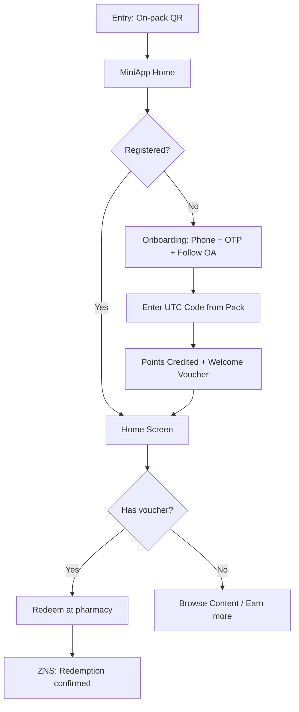
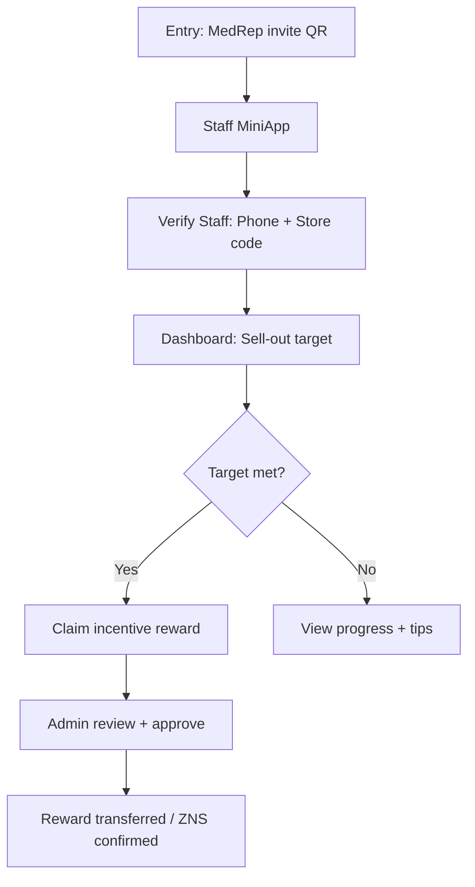

# AdtimaBox Solution Designer — Extended Patterns

Supplement to `solution-designer-core`. Use these patterns for complex scenarios.

---

## MULTI-ACTOR FLOW DESIGN

When a client has multiple audience types (e.g. FMCG: end-consumer + B2B retailer/pharmacy staff):

**Rule:** Separate MiniApp per actor type OR one MiniApp with role-based entry gate.

| Actor | Recommended approach |
|---|---|
| End consumer | Standard CShub MiniApp — QR / Zalo Ad entry |
| Pharmacy staff / B2B | Separate MiniApp OR staff portal — invite-only, role-gated |
| Both on same MiniApp | Flag for tech confirmation — non-standard, requires role logic |

**Two-MiniApp setup (standard):**
```
Consumer MiniApp: loyalty / voucher / content
Staff MiniApp: sell-out tracking / incentive program / training content
```

**IMPORTANT:** Never merge consumer loyalty and staff incentive into a single flow without explicit tech sign-off.

---

## HCP / PHARMA FLOW PATTERN

For pharma clients targeting Healthcare Professionals (doctors, pharmacists):

**Compliance constraint (from A4):** Cannot claim product drives diagnosis/prescription decisions. Content = educational only.

```
PHARMA HCP JOURNEY:
Entry: MedRep QR in clinic visit
    ↓
HCP Onboarding: phone + specialty registration
    ↓
Gated content access (educational material, scientific updates)
    ↓
CME tracking (if applicable)
    ↓
ZNS: new content alerts, conference invitations
    ↓
(No voucher / direct incentive — check compliance)
```

**Screen spec for HCP:**
- Profile screen: specialty, hospital, license number (optional)
- Content Library: articles, videos, clinical guidelines
- Event calendar: webinars, conferences
- No loyalty points / reward catalog (compliance risk unless structured correctly)

---

## OFFLINE-TO-ONLINE BRIDGE PATTERNS

| Offline touch | Bridge mechanism | Package impact |
|---|---|---|
| On-pack QR | UTC code scan in MiniApp | Campaign add-on |
| Receipt photo | Scan Bill AI recognition | Campaign add-on |
| POS transaction | API push (requires integration) | Integration fee |
| PG-assisted | PG scans customer QR on staff device | No extra cost |
| Workshop QR | Static QR at event | No extra cost |
| Scratch card | Code input in MiniApp | UTC add-on |

**Design rule:** On-pack and receipt always need UTC/Scan Bill add-on cost line in quote.

---

## AUTOMATION SEQUENCE DESIGN

Map trigger → delay → action for each automation in the journey:

| Trigger | Delay | Action | Channel |
|---|---|---|---|
| Onboarding complete | Immediate | Welcome message | ZNS / OA broadcast |
| Points earned | Immediate | Points notification | ZNS |
| Tier upgrade | Immediate | Tier congratulations | ZNS |
| 14 days inactive | Day 14 | Re-engagement nudge | OA broadcast |
| 30 days inactive | Day 30 | Winback + voucher | OA broadcast |
| Voucher expiry -3d | T-3 | Expiry reminder | ZNS |
| Birthday | Day 0 | Birthday voucher | ZNS |

**Package requirement:** All automation sequences require Pro 1+.

---

## MERMAID DIAGRAM — EXTENDED EXAMPLES

### Pharma B2C (voucher + earn points)


### FMCG B2B Staff Incentive


---

## COMPLIANCE INTEGRATION CHECK

Before finalizing any flow, verify against A4 Compliance output:

- [ ] All HIGH flags resolved (or flow blocked)
- [ ] MEDIUM conditions noted as disclaimer/docs required
- [ ] Pharma health claims removed from user-facing screens
- [ ] Data consent screen present at onboarding (for any data collection)
- [ ] Voucher/reward screens don't imply prescription incentive (pharma)
